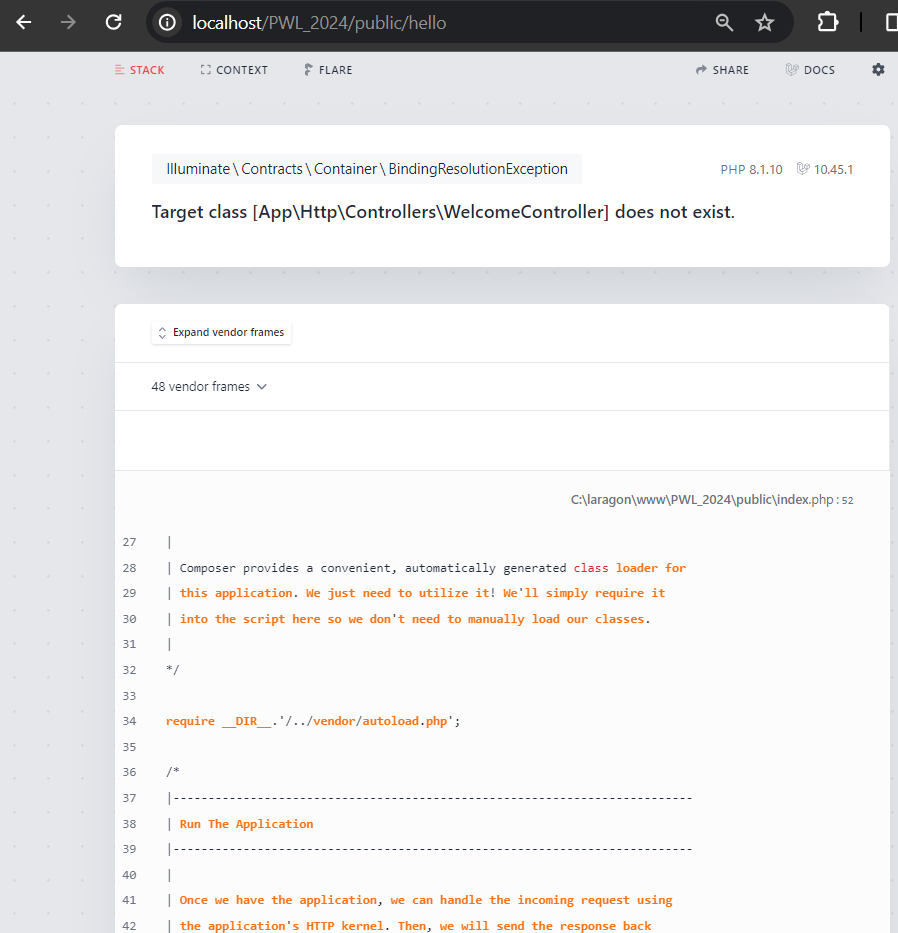
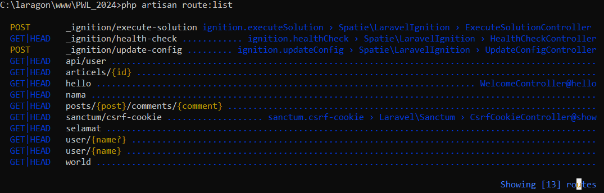
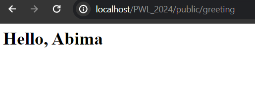
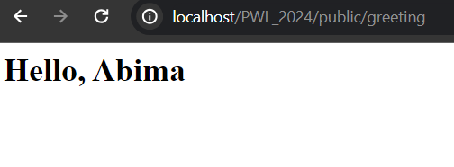
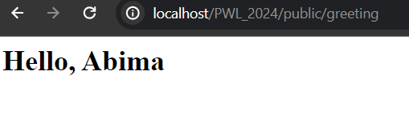
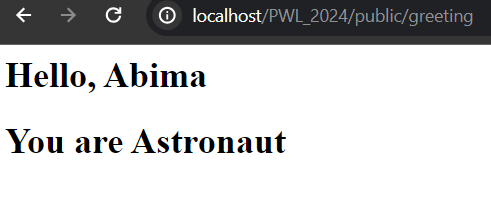

--PRAKTIKUM 1--

1. Route hello
   

2. Route world
   

3. Route selamat
   

4. Route nama
   

--PRAKTIKUM 2--

1. Route /user/{name}
   

2. Selanjutnya, coba tuliskan URL: localhost/PWL_2024/public/user/. Perhatikan halaman yang muncul dan jelaskan pengamatan anda
   Jawaban : yang ditampilkan 404 not found karena kita harus menggunakan parameter untuk memanggilnya.

3. 
   Route::get('/articels/{id}', function ($Id) {
   return 'Halaman Artikel dengan ID ' . $Id;
   });

--PRAKTIKUM 3--

1. 
   Output yang dihasilkan hanya "Nama saya" karena parameter tidak disertakan dalam URL.

2. 

3. 
   Output yang dihasilkan adalah "Nama saya John" karena tidak ada nilai dalam URL jadi nilai default John digunakan secara otomatis

--PRAKTIKUM Controler--

1. 

2. <?php

namespace App\Http\Controllers;

use Illuminate\Http\Request;

class PageController extends Controller
{
public function index()
{
return 'Selamat Datang';
}

    public function about()
    {
        $nim = '2241720025';
        $nama = 'Abima Fadricho Syuhadak';

        return 'NIM : ' . $nim . ' ' .
            'Nama : ' . $nama;
    }
    public function articles($id)
    {
        return 'Halaman Artikel dengan Id ' . $id;
    }

};

Untuk Routingnya

Route::get('/', [PageController::class, 'index']);
Route::get('/about', [PageController::class, 'about']);
Route::get('/articles{id}', [PageController::class, 'articles']);

3.  Route::get('/', [HomeController::class, "index"]);  
    Route::get('/about', [AboutController::class, 'About']);  
    Route::get('/articles{id}', [ArticleController::class, 'articles']);

--PRAKTIKUM Resource Controller--

1. 

--PRAKTIKUM View--

1. 

2.  view dalam direktori

3.  menampilkan view dari controller

4.  manerusakan data ke view
